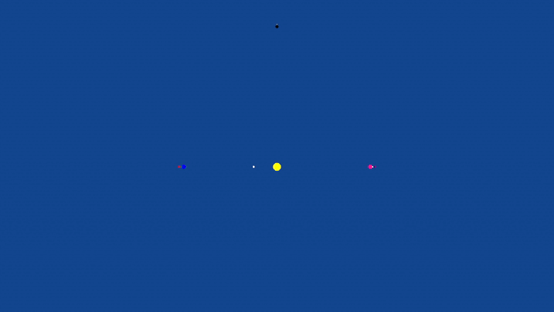
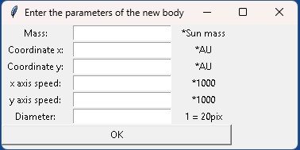

# Planet Simulation in Python

A beautiful 2D planetary system simulation built with **Python** using `tkinter` and `turtle`.  
Watch planets orbit under real Newtonian gravity, add your own celestial bodies, and visualize their trajectories and velocity vectors in real time.



## Features

- Accurate **Newtonian gravity** physics engine
- Default system with **2–10 planets** (fully customizable)
- Add your own planets: set **mass**, **position**, **initial velocity**, and **size**
- Real-time **orbit tracing** (trajectories)
- Toggle **velocity vectors** display
- Interactive keyboard controls:
  - `S` → Start / pause simulation  
  - `T` → Toggle trajectory drawing  
  - `C` → Clear trajectories  
  - `W` → Show/hide velocity vectors  
  - `M` → Return to main menu  
  - `Esc` → Exit
 
## Screenshots

| Main simulation (with trails + vectors) | Adding a custom planet |
|----------------------------------------|------------------------|
|  |  |

## Requirements

- **Python 3.6+**  
  (`tkinter` and `turtle` are included in standard Python installation — no extra packages needed)

## Installation & Running

```bash
git clone https://github.com/your_username/PlanetSimulationPython.git
cd PlanetSimulationPython
python main.py
